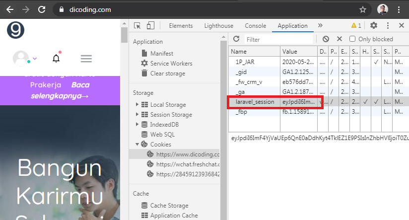
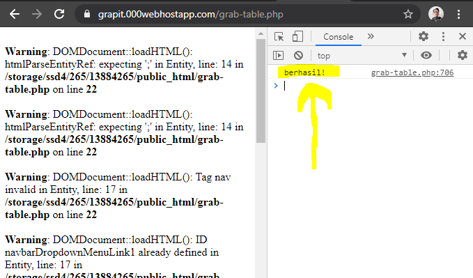
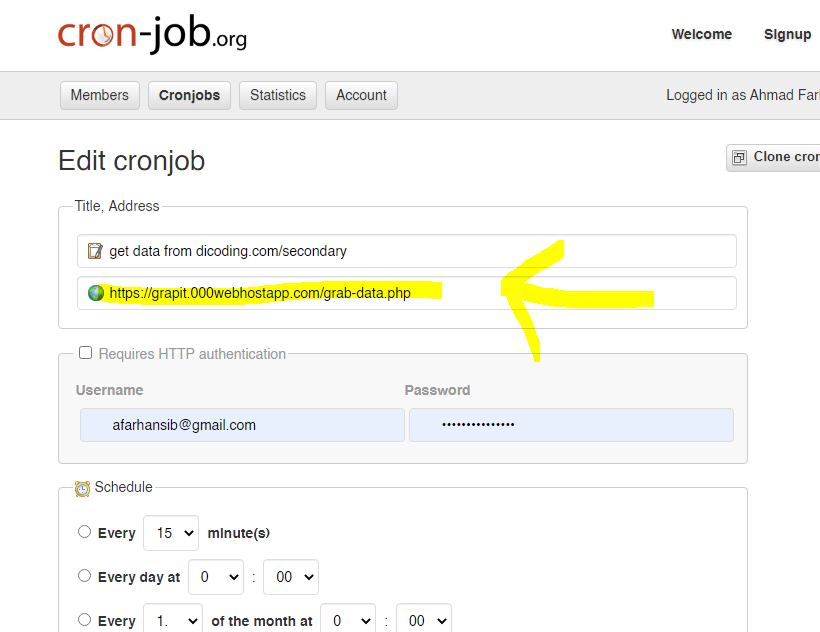

# Grapit

Grapit (graph it) adalah script php sederhana yang berfungsi untuk mengambil data dari Dicoding dan memformatnya dalam bentuk chart.  Berikut adalah penjelasan singkat bagaimana menggunakan script ini.

## Instalasi
Untuk menginstalnya cukup clone project ini, kemudian upload ke sebuah php hosting yang mengizinkan Access-Control-Allow-Origin nya dimodifikasi, contoh web hosting gratis yang sudah saya coba adalah 000webhost.com.

## Setup

### 1. Simpan Cookie Dicoding

Simpan **semua** value dari cookie `laravel_session` di halaman Dicoding anda di bagian awal file `grab-table.php` dan `grab-data.php`.

### 2. Buat file data.json

File ini akan digunakan untuk menyimpan semua data yang akan diperoleh nantinya. Data dalam file ini berupa timestamp, nama, tokenid, dan progressnya.

Untuk membuat file ini cukup dengan membuka file `grab-table.php` melalui web browser biasa, kemudian pastikan response yang ada di console adalah `berhasil!`. Hiraukan **Warning**-nya.

> **Memanggil file ini akan selalu me-reset file data.json**

Sampai sini seharusnya file data.json anda telah berisi nama dan tokenid peserta.

### 3.  Dapatkan data pertama

Langkah ini bisa untuk mencoba apakah semuanya telah berfungsi dengan semestinya. Caranya hanya dengan memanggil file `grab-data.php` baik melalui browser atau client lainnya, pastikan mendapatkan response berupa string `data saved!`.

Kemudian coba buka halaman index.html, pastikan data pertama sudah tercetak.

### 4. Konfigurasi Cron Job

Langkah ini opsional,  jika Anda mau mendapatkan data secara rutin (misalnya setiap hari sekali) maka lakukan langkah ini.

Untuk mengonfigurasi cron job anda bisa menggunakan cron job bawaan hosting, atau menggunakan layanan cron job eksternal.

Saya sendiri menggunakan layanan dari cron-job.org karena pengaturan waktunya lebih fleksibel daripada cron job bawaan hosting saya (000webhost) 

Saya rasa itu sudah semua. Terima kasih.